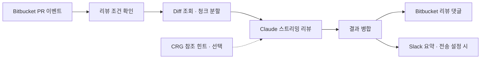
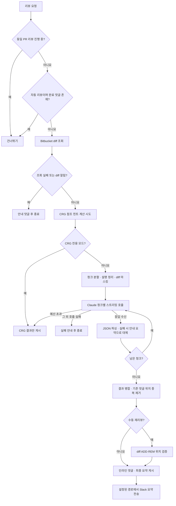
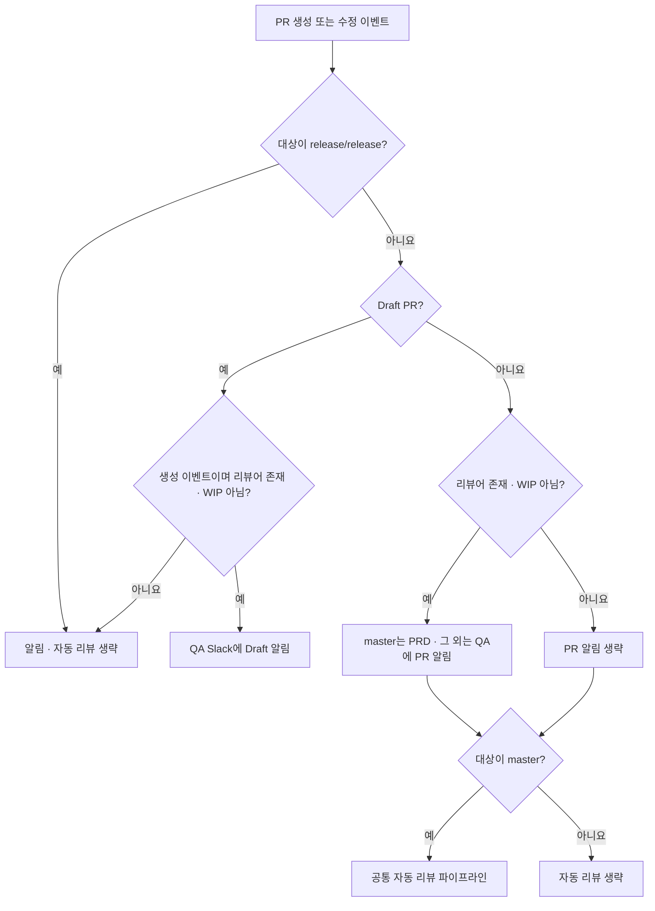
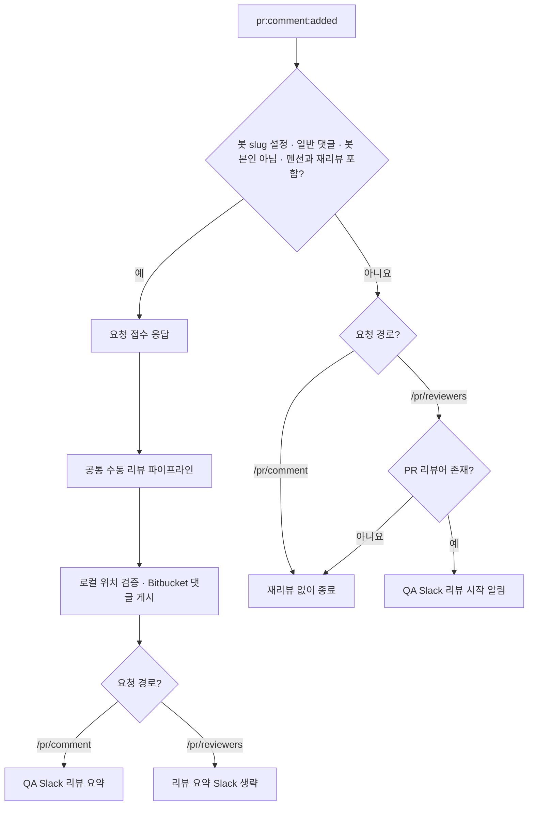
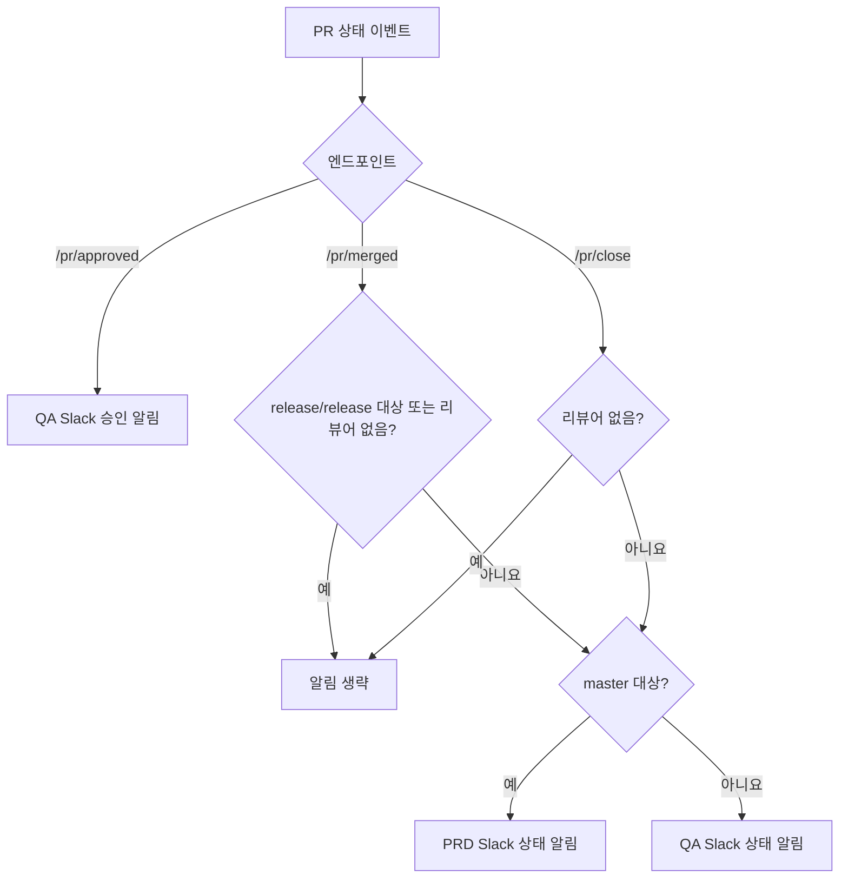
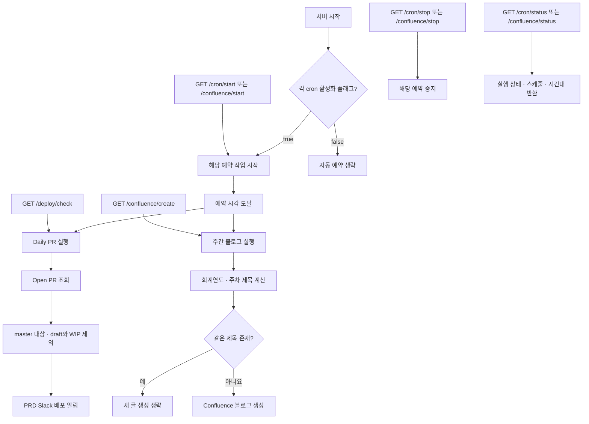

<div align="center">

# Claude Code Review Agent

**Bitbucket PR에 코드리뷰를 더하는 AI 에이전트**

PR이 열리면 변경사항을 읽고, 코드 옆에 리뷰를 남깁니다.<br>
Claude 스트리밍 리뷰부터 Slack 알림, 선택적 심볼 참조 분석까지.

[](https://nodejs.org/)
[](package.json)
[](#webhooks)
[](LICENSE)

[빠른 시작](#quick-start) · [주요 기능](#features) · [설정](#configuration) · [문서](#documentation)

</div>

---

Bitbucket Server / Data Center의 PR 웹훅을 받아 Claude로 코드리뷰를 작성하는 TypeScript 서버입니다. 결과는 Bitbucket 인라인 댓글과 요약 댓글로 남기고, 설정된 경로의 리뷰 요약을 Slack으로 전달합니다.

> [!NOTE]
> **Bitbucket 온프레미스 환경을 위한 프로젝트입니다.** GitHub는 소스 공개 공간이며, GitHub PR과 Bitbucket Cloud 연동은 지원하지 않습니다.

<details>
<summary><strong>목차 펼치기</strong></summary>

- [주요 기능](#features)
- [리뷰 흐름](#how-it-works)
- [코드리뷰 방식](#review-method)
- [엔드포인트별 흐름](#endpoint-flows)
- [빠른 시작](#quick-start)
- [CRG(Code Review Graph) 사용](#code-review-graph)
- [환경변수](#configuration)
- [Bitbucket 웹훅 연결](#webhooks)
- [재리뷰 요청](#re-review)
- [빌드 및 Docker](#deployment)
- [운영 범위와 제약](#limitations)
- [문서와 기여](#documentation)
- [라이선스](#license)

</details>

<a id="features"></a>

## 주요 기능

| 기능 | 설명 |
|---|---|
| **자동 코드리뷰** | `master` 대상 non-draft PR을 분석하고 인라인·요약 댓글 작성 |
| **댓글로 재리뷰** | `@review-bot 재리뷰`로 횟수 제한 없이 다시 요청 |
| **청크 기반 스트리밍** | 큰 diff를 약 40,000자씩 나눠 순차 처리하고 결과 병합 |
| **심볼 참조 힌트** | 선택적 CRG 분석으로 함께 확인할 호출부 안내 |
| **리뷰 전후 검증** | diff의 민감정보 패턴 마스킹, 수동 재리뷰의 인라인 위치 검증 |
| **팀 알림과 예약 작업** | PR·리뷰 Slack 알림, 선택적 Daily PR·Confluence 주간 블로그 |

<a id="how-it-works"></a>

## 리뷰 흐름



모든 청크의 호출과 결과 처리가 끝난 뒤 댓글 게시를 시작합니다. CRG 분석이 실패하면 힌트 없이 리뷰를 계속 시도하고, Claude의 `budget_exceeded` 응답에는 이미 계산한 CRG 결과만 게시합니다.

<a id="review-method"></a>

## 어떤 방식으로 리뷰하나요?

전체 저장소를 매번 Claude에 보내는 방식이 아니라 **PR diff를 중심으로 변경의 영향과 머지 위험을 검토**합니다. PR 설명은 의도를 이해하는 데 쓰고, 선택적으로 CRG에서 찾은 참조 관계를 함께 제공합니다.

| 단계 | 처리 방식 |
|---|---|
| **맥락 구성** | 미작성 PR 설명 템플릿을 제거하고, CRG가 있으면 변경 심볼의 참조 파일·인터페이스 변경 힌트 추가 |
| **입력 준비** | 파일·라인 경계를 보존해 약 40,000자 청크로 분할하고 diff의 민감정보 패턴 마스킹 |
| **Claude 분석** | 청크별 스트리밍 호출. 한 PR 안에서는 순차 실행하고 전체 PR은 기본 동시성 4를 공유 |
| **리뷰 기준** | 실제 변경에서 확인되는 버그, API·타입 계약, 보안, 성능, 상태 회귀를 우선. diff 밖의 구현을 추측하지 않도록 지시 |
| **결과 정리** | 변경 요약, 흐름상 체크할 점, 머지 전 확인 포인트, P1~P5 인라인 의견으로 구조화 |
| **댓글 게시** | 청크 결과 병합과 기존 댓글 위치 중복 제거. 수동 재리뷰는 ADD/REM 위치까지 검증한 뒤 게시 |

**자동 리뷰와 수동 재리뷰의 차이**

| 항목 | 자동 리뷰 | 수동 재리뷰 |
|---|---|---|
| 시작 조건 | PR 생성·수정 | 일반 댓글의 봇 멘션 + `재리뷰` |
| 대상 | `master` 대상 non-draft | 브랜치·draft 제한 없음 |
| 기존 완료 댓글 | 있으면 건너뜀 | 있어도 다시 실행 |
| 실행 횟수 | 완료 시그니처로 중복 방지 | 횟수 제한 없음 |
| 진행 중인 동일 PR | 추가 실행 건너뜀 | 추가 실행 건너뜀 |
| CRG 참조 힌트 | 사용 시도 | 사용 시도 |
| 인라인 위치 검증 | 비활성 | 활성 |
| Slack 리뷰 요약 | QA 채널 | `/pr/comment`는 전송, `/pr/reviewers`는 생략 |

<details>
<summary><strong>리뷰 파이프라인 상세 흐름</strong></summary>



CRG 실패는 Claude 호출을 막지 않습니다. 파싱할 수 없는 응답은 해당 청크의 인라인 의견 없이 안내 요약으로 대체하고, 출력 잘림을 감지하면 최종 댓글에 안내를 추가합니다. 모든 청크 처리가 끝난 뒤 게시를 시작하지만, 게시 도중 네트워크 오류가 나면 일부 댓글이 이미 남아 있을 수 있습니다.

</details>

<a id="endpoint-flows"></a>

## 엔드포인트별 흐름

웹훅은 이벤트별 라우터로 들어오고, AI 분석이 필요한 요청만 공통 리뷰 파이프라인으로 이어집니다. 아래 그래프는 정상 이벤트의 주요 분기를 보여줍니다.

<details>
<summary><strong>1. PR 생성·수정 — POST /pr/open · /pr/modified</strong></summary>



PR 알림과 AI 리뷰는 조건이 다릅니다. 리뷰어가 없거나 WIP 제목이어도 `master` 대상 non-draft면 자동 리뷰를 시도합니다. 리뷰 완료를 기다리지 않고 웹훅 응답을 반환합니다.

</details>

<details>
<summary><strong>2. 댓글 재리뷰 — POST /pr/comment · /pr/reviewers</strong></summary>



`/pr/reviewers`는 이름과 달리 리뷰어 변경 이벤트가 아닌 **댓글 이벤트**를 처리합니다. 재리뷰 조건이 아닌 댓글도 PR에 리뷰어가 있으면 리뷰 시작 알림으로 전달합니다. 두 경로에 같은 이벤트를 연결하면 처리가 겹칠 수 있으므로 재리뷰용 경로는 하나를 선택하세요.

</details>

<details>
<summary><strong>3. 승인·머지·닫힘 알림 — POST /pr/approved · /pr/merged · /pr/close</strong></summary>



세 경로는 상태 알림만 보내며 Claude 리뷰를 실행하지 않습니다. `/pr/close`는 `pr:deleted` 이벤트를 처리하고, `/pr/merged`와 달리 `release/release`를 별도로 제외하지 않습니다.

</details>

<details>
<summary><strong>4. 예약 작업·수동 관리 — GET /deploy/check · /cron/* · /confluence/*</strong></summary>



`start`·`stop`은 해당 예약을 제어합니다. `/deploy/check`와 `/confluence/create`는 예약 활성화 여부와 무관하게 즉시 실행합니다. `/health-check`는 서버 응답만 확인하며, PR 라우터의 `/health`는 `open`, `modified`, `comment`, `approved`, `merged`, `close`에 제공됩니다. 헬스체크는 외부 서비스 연결 상태까지 검증하지 않습니다.

</details>

<a id="quick-start"></a>

## 빠른 시작

Node.js **24 이상, 25 미만**과 npm이 필요합니다. `node:sqlite` 내장 모듈을 사용하며, 버전 관리 파일은 최신 Node 24를 선택합니다.

### 1. 설치

```bash
git clone https://github.com/Junyong34/clacude-code-review-agent.git
cd clacude-code-review-agent
nvm install
nvm use
npm ci
cp .env.example .env.local
```

### 2. 연결 정보 설정

`.env.local`에 다음 값을 입력합니다. 전체 항목은 [환경변수 안내](#configuration)를 참고하세요.

| 연결 대상 | 준비할 값 |
|---|---|
| **Bitbucket** | PR collection URL, 읽기 인증 헤더, 봇 인증 헤더와 slug |
| **Claude** | API 키, 사용 가능한 모델 ID |
| **Slack** | PRD·QA 알림을 받을 Incoming Webhook URL |

### 3. 실행

```bash
npm run dev
```


서버 포트는 `8088`로 고정되어 있습니다. `GET /health-check`로 확인할 수 있습니다. 로컬 서버도 연결된 웹훅 요청을 받으면 실제 PR 댓글과 Slack 알림을 보냅니다.

<a id="code-review-graph"></a>

## CRG(Code Review Graph) 사용

CRG는 **변경된 함수·컴포넌트를 사용하는 파일 중 이번 PR에서 수정되지 않은 파일**을 찾아 리뷰 맥락을 보완하는 선택 기능입니다. 예를 들어 `getUser(id)`의 필수 인자가 바뀌었는데 이를 호출하는 `profile.ts`가 PR에 없다면, 해당 파일도 확인하도록 Claude 입력과 최종 PR 댓글에 힌트를 제공합니다. 참조 관계가 있다는 이유만으로 버그나 수정 누락으로 확정하지는 않습니다.

### 연동 방식과 역할

이 프로젝트는 `code-review-graph`를 npm 라이브러리로 import하지 않습니다. **별도로 설치한 외부 CLI를 실행하고, 생성된 SQLite DB를 직접 읽습니다.** CRG의 MCP 서버는 사용하지 않으며 `npm ci`만으로 CLI가 설치되지 않습니다.

| 구성 요소 | 이 프로젝트에서의 역할 |
|---|---|
| `code-review-graph` CLI | 대상 저장소의 그래프를 최초 생성(`build`)하고 이후 갱신(`update`) |
| Node.js 내장 `node:sqlite` | `.code-review-graph/graph.db`를 읽기 전용으로 열어 `nodes`·`edges` 조회 |
| TypeScript 컴파일러 API | 변경 전 소스와 PR diff를 바탕으로 매개변수·props·반환값 등 인터페이스 변경 판정 |
| Claude | PR diff·설명과 CRG 힌트를 함께 받아 코드리뷰 작성 |

CRG는 참조 관계를 제공하고, 인터페이스 변경 판정과 댓글 구성은 이 서비스가 담당합니다. 구현은 [워크트리·CLI 실행](src/services/contextClone/index.ts), [심볼 참조 조회](src/services/codeReview/symbolReference.ts), [인터페이스 판정](src/services/codeReview/interfaceChange.ts)에서 확인할 수 있습니다.

### 준비와 설정

1. Node.js **24 이상, 25 미만**, Git, 대상 저장소의 기존 clone을 준비합니다. clone에는 `origin` 원격과 `master` 브랜치가 있어야 하며, 서버 실행 계정에 원격 fetch 권한이 필요합니다. 서비스가 대상 저장소를 자동으로 clone하지는 않습니다.
2. [code-review-graph 저장소](https://github.com/tirth8205/code-review-graph)의 설치 안내에 따라 CLI와 실행 환경을 별도로 준비합니다. **서버 실행 계정의 PATH**에서 아래 명령이 실행되는지 확인합니다.

   ```bash
   code-review-graph --version
   code-review-graph build --help
   code-review-graph update --help
   ```

   이 프로젝트는 호환 CLI 버전을 고정하지 않습니다. 설치 버전이 `build --repo <path> --quiet`, `update --repo <path> --quiet` 옵션과 위 DB 경로·테이블 구조를 지원해야 합니다.

3. `.env.local` 또는 `.env.production`에 다음 값을 설정하고 서버를 시작합니다.

   ```dotenv
   # 리뷰 대상 저장소의 기존 clone 절대 경로
   CODE_REVIEW_CONTEXT_CLONE_PATH=/path/to/example-app
   # 봇만 사용하는 워크트리 경로. 상대 경로는 서버 실행 디렉터리 기준
   CODE_REVIEW_MASTER_WORKTREE_DIR=.worktrees/code-review-master
   # 일반 Claude 리뷰에 CRG 힌트를 함께 제공
   CODE_REVIEW_CRG_ONLY=false
   ```

서버 실행 계정은 컨텍스트 clone의 Git 메타데이터와 전용 워크트리에 쓸 수 있어야 합니다. **워크트리 경로에는 개인 작업 폴더를 지정하지 마세요.** 매 리뷰에서 이 경로를 `origin/master`로 강제 동기화하므로 추적 파일의 로컬 수정이 사라집니다. 원본 clone에는 fetch만 수행하며 기존 체크아웃과 미커밋 작업 파일을 보존합니다.

### 리뷰에서 사용하는 흐름

자동 리뷰와 수동 재리뷰 모두 다음 과정을 사용합니다.

1. 원본 clone에서 `git fetch origin master`를 실행합니다.
2. 봇 전용 detached 워크트리를 생성하거나 기존 워크트리를 `origin/master`로 갱신합니다. 워크트리는 리뷰가 끝나도 유지하고 재사용합니다.
3. 워크트리에 그래프 DB가 없으면 CLI의 `build`, 있으면 `update`를 실행합니다. 최초 생성은 저장소 크기에 따라 시간이 걸릴 수 있습니다.
4. PR diff의 삭제·문맥 줄에 있는 변경 전 라인 번호를 그래프의 `Function` 노드 범위와 대조합니다. 해당 심볼을 향하는 `CALLS`·`REFERENCES` 관계를 조회하고, PR에서 이미 변경한 파일은 참조 파일 목록에서 제외합니다.
5. 인터페이스 변경을 판정해 Claude에 심볼·파일 경로·변경 요약을 힌트로 전달합니다. 호출부 소스 전체를 추가로 전달하는 방식은 아닙니다. 최종 PR 댓글에도 호출부 확인 항목을 붙입니다.

매개변수·props·반환값의 호환성에 영향을 줄 수 있는 변경은 **호출부 확인이 필요합니다**, 판정하지 못한 변경은 **자동 확인이 제한된 항목**으로 표시합니다. 구현만 바뀌었거나 호환 가능한 인터페이스 변경으로 판정한 항목은 힌트와 댓글에서 제외합니다.

### 전용 모드·실패 처리·제약

- `CODE_REVIEW_CRG_ONLY=true`이면 Claude를 호출하지 않고 CRG 결과만 PR 댓글로 게시합니다. 로컬 출력만 확인하는 모드가 아니므로 실제 댓글이 남습니다.
- 일반 모드에서 Claude가 `budget_exceeded`로 실패해도 이미 계산한 CRG 결과를 게시합니다. CRG 전용 모드와 예산 초과 결과에는 정상 리뷰 완료 시그니처가 없어 이후 재리뷰를 요청할 수 있습니다.
- 환경변수 미설정, Git 인증 실패, CLI 부재·호환성 문제, DB 조회 오류가 나면 일반 모드에서는 힌트 없이 Claude 리뷰를 계속 시도합니다. 빈 결과만으로는 참조가 없는 경우와 조회 실패를 구분할 수 없으므로 서버 로그를 함께 확인합니다.
- 그래프 기준은 **최신 master**이며 PR 브랜치를 checkout하지 않습니다. PR의 기준 커밋과 master가 다르거나 새로 추가된 심볼처럼 변경 전 라인과 매칭할 수 없는 경우에는 참조를 놓칠 수 있습니다. 전체 영향 범위를 보장하는 검사가 아닙니다.
- Git·그래프 갱신은 프로세스 내부에서 한 번에 하나씩 실행하지만 이후 조회는 잠금 밖에서 수행합니다. 여러 프로세스가 같은 워크트리를 공유하는 구성까지 보호하지는 않습니다.
- 기본 Docker 이미지에는 CRG CLI와 대상 clone이 없습니다. 컨테이너에서 사용하려면 CLI가 설치된 이미지, Git 인증, clone·워크트리의 지속 저장 공간을 별도로 준비해야 합니다.

세부 운영 조건과 검증 대상은 [CRG 설정 가이드](docs/crg-symbol-reference.md)를 참고하세요.

<a id="configuration"></a>

## 환경변수

[.env.example](.env.example)을 복사해 설정하세요. 인증 헤더에는 `Bearer ...` 또는 `Basic ...`처럼 인증 방식을 포함한 전체 값을 입력합니다. 읽기 계정은 PR 조회 권한, 봇 계정은 댓글 작성 권한이 필요합니다.

<details>
<summary><strong>전체 환경변수 보기 — 인증, 모델, 알림, 예약 작업, CRG</strong></summary>

| 변수 | 용도 / 기본값 |
|---|---|
| `BITBUCKET_API_URL` | 필수. 단일 저장소의 `.../pull-requests?state=OPEN` collection URL |
| `BITBUCKET_AUTH_HEADER` | PR 목록·diff·활동 조회 인증 |
| `BITBUCKET_BOT_AUTH_HEADER` | 봇 댓글 작성 인증 |
| `BITBUCKET_BOT_SLUG` | 봇 계정 이름. 멘션·자기 댓글 구분에 사용 |
| `ANTHROPIC_API_KEY` | Claude 호출 인증 |
| `CLAUDE_MODEL` | 기본 `claude-sonnet-5`. 계정 또는 프록시에서 지원하는 모델 ID로 설정 |
| `ANTHROPIC_BASE_URL` | 선택. Anthropic SDK의 호환 프록시 주소 |
| `CLAUDE_STREAM_CONCURRENCY` | 전체 Claude 스트림 동시 실행 상한. 기본 `4`, 양의 정수 |
| `SLACK_WEBHOOK_URL_PRD` / `SLACK_WEBHOOK_URL_QA` | 운영 대상 / 기타 이벤트 알림 주소. PR 알림 흐름을 사용하려면 두 주소 설정 |
| `JIRA_BASE_URL` | 선택. 이슈 링크의 `/browse`까지 포함한 주소. 없으면 제목을 그대로 표시 |
| `DEPLOY_CHECKLIST_URL` | 선택. Daily PR 알림에 넣을 배포 체크리스트 주소 |
| `ENABLE_DAILY_PR_CRON` | `true`일 때 서버 시작 시 Daily PR 예약. 기본 `false` |
| `CRON_EXPRESSION` | Daily PR 예약. 기본 `00 09 * * 1-5`, Asia/Seoul |
| `SLACK_TARGET_USERS` | Daily PR CC 대상. 쉼표로 구분한 Slack 멘션 문자열 |
| `ENABLE_WEEKLY_BLOG_CRON` | `true`일 때 주간 블로그 예약. 기본 `false`, 월요일 06:00 KST |
| `ATLASSIAN_SITE`, `ATLASSIAN_EMAIL`, `ATLASSIAN_API_TOKEN`, `CONFLUENCE_SPACE_KEY` | Confluence 기능을 사용할 때 설정 |
| `MAX_W` | 주간 블로그 주차 계산 상한. 기본 `45` |
| `CODE_REVIEW_CONTEXT_CLONE_PATH` | 선택. CRG용 기존 대상 저장소 clone 경로 |
| `CODE_REVIEW_MASTER_WORKTREE_DIR` | CRG 전용 워크트리. 기본 `.worktrees/code-review-master` |
| `CODE_REVIEW_CRG_ONLY` | `true`이면 Claude 호출 없이 CRG 결과만 게시. 기본 `false` |

</details>

사설 인증서를 사용하면 `NODE_EXTRA_CA_CERTS`에 신뢰할 PEM CA 파일을 지정하세요. 인증서 검증을 끄는 설정은 제공하지 않습니다.

<a id="webhooks"></a>

## Bitbucket 웹훅 연결

Bitbucket에서 접근 가능한 서버 주소에 다음 이벤트를 연결합니다.

| 이벤트 | 경로 |
|---|---|
| `pr:opened` | `POST /pr/open` |
| `pr:modified` | `POST /pr/modified` |
| `pr:comment:added` | `POST /pr/comment` |
| `pr:reviewer:approved` | `POST /pr/approved` |
| `pr:merged` | `POST /pr/merged` |
| `pr:deleted` | `POST /pr/close` |

리뷰 시작 알림도 필요하면 `POST /pr/reviewers`에 `pr:comment:added`를 연결할 수 있습니다. 이 경로도 재리뷰를 처리하므로 두 댓글 경로에 동시에 연결하면 조회가 중복될 수 있습니다.

<a id="re-review"></a>

## 재리뷰 요청

PR의 일반 댓글에서 봇을 멘션하세요.

```text
@review-bot 재리뷰
```

자동 리뷰는 완료 댓글이 없는 `master` 대상 non-draft PR에서 실행합니다. 수동 재리뷰는 PR의 일반 댓글에 `@review-bot 재리뷰` 또는 `[~review-bot] 재리뷰`를 작성합니다. 실제 slug로 바꾸세요. 횟수 제한은 없고, 같은 PR의 리뷰가 진행 중이면 요청을 건너뜁니다.

<a id="deployment"></a>

## 빌드 및 Docker

### 로컬 빌드

```bash
npm run typecheck
npm test
npm run build
# npm start는 env 파일을 읽지 않으므로 환경변수를 실행 환경에서 주입
npm start
```

`npm run dev`는 `.env.local`, `npm run prod`는 `.env.production`을 읽어 TypeScript 소스를 실행합니다.

### Docker 실행

```bash
cp .env.example .env.production
# .env.production 값 입력
docker compose up -d --build
```

Docker는 `.env.production`을 실행 시 주입합니다. env 파일은 이미지에 복사하지 않습니다. 기본 이미지에는 CRG CLI 설치와 대상 저장소 마운트가 포함되어 있지 않습니다. CRG 사용 시 [별도 구성 가이드](docs/crg-symbol-reference.md)를 따르세요.

<a id="limitations"></a>

## 운영 범위와 제약

> [!IMPORTANT]
> 서버 자체에는 웹훅 서명 검증과 관리 API 인증이 없습니다. 인증·접근 제어를 갖춘 프록시 또는 제한된 네트워크 뒤에서 운영하세요.

- 단일 Bitbucket 저장소와 `master` 브랜치를 전제로 합니다. `release/release` 대상의 일부 알림·자동 리뷰는 생략합니다.
- `/deploy/check`, `/cron/start|stop|status`, `/confluence/start|stop|status|create`는 수동 관리 API입니다. cron 활성화 플래그는 자동 시작만 제어하므로 이 API의 실행을 막지 않습니다.
- Claude에 diff와 PR 설명, CRG 힌트를 전송합니다. 정규식 마스킹은 diff에 적용되며 모든 비밀정보 제거를 보장하지 않습니다.
- 인라인 위치 검증은 현재 수동 재리뷰에서 활성화됩니다. 자동 리뷰에도 동일하게 적용되는 것으로 가정하지 마세요.
- 동시 실행 제어는 프로세스 내부에만 적용됩니다. 다중 인스턴스 분산 잠금과 다중 저장소 지원은 포함하지 않습니다.
- AI 결과는 검토를 돕는 자료입니다. Bitbucket이 diff를 잘라 반환하면 리뷰를 건너뛰고 안내 댓글을 남깁니다.

<a id="documentation"></a>

## 문서와 기여

| 문서 | 이런 내용을 찾을 때 |
|---|---|
| [운영 가이드](docs/ai-code-review-agent-guide.md) | 리뷰 조건, 알림, 실패 대응 |
| [개발자 파이프라인](docs/ai-code-review-pr-flow.md) | 호출 순서, 용어, 검증 경계 |
| [CRG 설정](docs/crg-symbol-reference.md) | 외부 도구, 워크트리, 구성 제한 |
| [정리 내역](docs/open-source-cleanup.md) | 삭제·통합 목록과 공개용 설정 변경 |
| [에이전트 작업 지침](AGENTS.md) | 코드 변경 시 참고 문서와 검증 기준 |

### 기여하기

변경을 제안할 때 재현 방법과 검증 결과를 함께 남겨 주세요. 테스트는 외부 서비스 대신 mock과 임시 Git 저장소를 사용합니다. CRG CLI가 없으면 해당 통합 테스트 일부는 건너뜁니다.

---

<a id="license"></a>

## 라이선스

[MIT License](LICENSE) · Copyright © 2026 clacude-code-review-agent contributors

<div align="center">

[맨 위로 돌아가기](#claude-code-review-agent)

</div>
