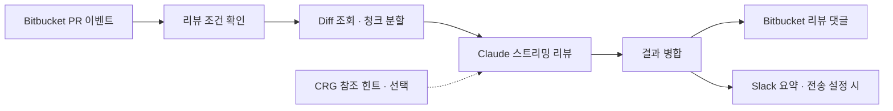

<div align="center">

# Claude Code Review Agent

**Bitbucket PR에 코드리뷰를 더하는 AI 에이전트**

PR이 열리면 변경사항을 읽고, 코드 옆에 리뷰를 남깁니다.<br>
Claude 스트리밍 리뷰부터 Slack 알림, 선택적 심볼 참조 분석까지.

[](https://nodejs.org/)
[](package.json)
[](#webhooks)
[](LICENSE)

[빠른 시작](#quick-start) · [주요 기능](#features) · [설정](#configuration) · [문서](#documentation)

</div>

---

Bitbucket Server / Data Center의 PR 웹훅을 받아 Claude로 코드리뷰를 작성하는 TypeScript 서버입니다. 결과는 Bitbucket 인라인 댓글과 요약 댓글로 남기고, 설정된 경로의 리뷰 요약을 Slack으로 전달합니다.

> [!NOTE]
> **Bitbucket 온프레미스 환경을 위한 프로젝트입니다.** GitHub는 소스 공개 공간이며, GitHub PR , GitLab PR 연동은 지원하지 않습니다.

<details>
<summary><strong>목차 펼치기</strong></summary>

- [주요 기능](#features)
- [리뷰 흐름](#how-it-works)
- [코드리뷰 방식](#review-method)
- [엔드포인트별 흐름](#endpoint-flows)
- [빠른 시작](#quick-start)
- [CRG(Code Review Graph) 사용](#code-review-graph)
- [환경변수](#configuration)
- [Bitbucket 웹훅 연결](#webhooks)
- [재리뷰 요청](#re-review)
- [빌드 및 Docker](#deployment)
- [운영 범위와 제약](#limitations)
- [문서와 기여](#documentation)
- [라이선스](#license)

</details>

<a id="features"></a>

## 주요 기능

| 기능 | 설명 |
|---|---|
| **자동 코드리뷰** | `master` 대상 non-draft PR을 분석하고 인라인·요약 댓글 작성 |
| **댓글로 재리뷰** | `@review-bot 재리뷰`로 횟수 제한 없이 다시 요청 |
| **청크 기반 스트리밍** | 큰 diff를 약 100,000자씩 나눠 순차 처리하고 결과 병합 |
| **심볼 참조 힌트** | 선택적 CRG 분석으로 참조 파일을 안내하고 호출부 코드를 Claude 입력에 추가 |
| **리뷰 전후 검증** | diff의 민감정보 패턴 마스킹, 수동 재리뷰의 인라인 위치 검증 |
| **팀 알림과 예약 작업** | PR·리뷰 Slack 알림, 선택적 Daily PR·Confluence 주간 블로그 |

<a id="how-it-works"></a>

## 리뷰 흐름


```mermaid
flowchart LR
    A[Bitbucket PR 이벤트] --> B[리뷰 조건 확인]
    B --> C[Diff 조회 · 청크 분할]
    C --> D[Claude 스트리밍 리뷰]
    E[CRG 참조 힌트 · 선택] -.-> D
    D --> F[결과 병합]
    F --> G[Bitbucket 리뷰 댓글]
    F --> H[Slack 요약 · 전송 설정 시]
```

모든 청크의 호출과 결과 처리가 끝난 뒤 댓글 게시를 시작합니다. CRG 분석이 실패하면 힌트 없이 리뷰를 계속 시도하고, Claude의 `budget_exceeded` 응답에는 이미 계산한 CRG 결과만 게시합니다.

<a id="review-method"></a>

## 어떤 방식으로 리뷰하나요?

**PR diff를 중심으로 버그와 계약 변경, 보안, 상태 회귀 등 머지 위험을 검토**합니다. 변경된 함수만 읽으면 PR에 포함되지 않은 기존 호출자가 새 인자나 반환값에 맞게 동작하는지 판단하기 어렵습니다. 주변 문맥을 늘려도 다른 파일의 호출 코드까지 보이지는 않습니다.

리뷰 입력에는 변경 라인 주변 25줄과 작성자가 쓴 PR 설명을 넣습니다. CRG를 설정하면 참조 파일 목록을 찾고, 서비스가 인터페이스 변경을 판정한 뒤 master의 호출부 코드 일부를 추가합니다. 이 정보는 두 곳에 쓰입니다. 최종 댓글에서는 사람이 확인할 파일을 안내하고, Claude SDK 프롬프트에서는 변경 코드와 기존 사용 방식을 함께 비교할 근거를 제공합니다.

예를 들어 `src/users.ts`의 함수 선언부가 다음처럼 바뀌었는데:

```diff
-export function getUser(id: string) {
+export function getUser(id: string, tenantId: string) {
```

PR에 포함되지 않은 `src/profile.ts`가 여전히 아래처럼 호출한다고 가정합니다.

```ts
export function loadProfile(id: string) {
    return getUser(id);
}
```

참조 파일 이름만으로는 실제 호출 방식까지 알 수 없습니다. 호출부 스니펫이 있으면 Claude가 필수 인자 추가와 기존 호출의 불일치를 읽고, 변경된 함수의 diff 라인에 호출부를 인용한 의견을 남길 수 있습니다. CRG는 참조 관계를 제공하고, 인터페이스 판정은 서비스가, 리뷰 판단은 Claude가 담당합니다.

CRG는 선택 기능이며 스니펫은 master 기준으로 일부만 제공합니다. 전체 호출부 검증이나 오답 방지를 보장하지 않습니다. 실제 리뷰 품질 향상 수치는 아직 측정하지 않았으며, 여기서 설명하는 효과는 **기존 호출부를 판단 근거에 추가한다는 것**입니다. [CRG가 보완하는 맥락](docs/code-review/crg-context.md)과 [제한과 실패 처리](docs/code-review/limits-and-failure-handling.md)에서 예제와 한계를 더 자세히 설명합니다.

**자동 리뷰와 수동 재리뷰의 차이**

| 항목 | 자동 리뷰 | 수동 재리뷰 |
|---|---|---|
| 시작과 대상 | PR 생성·수정, `master` 대상 non-draft | 일반 댓글의 봇 멘션 + `재리뷰`, 브랜치·draft 제한 없음 |
| 기존 완료 댓글 | 있으면 건너뜀 | 있어도 다시 실행, 횟수 제한 없음 |
| 인라인 위치 검증 | 비활성 | 활성 |

리뷰 내부 과정은 [PR부터 댓글까지](docs/code-review/pr-to-comments.md), 오류와 입력 제한은 [제한과 실패 처리](docs/code-review/limits-and-failure-handling.md), 재리뷰와 알림 조건은 [운영 가이드](docs/ai-code-review-agent-guide.md)를 참고하세요.

<a id="endpoint-flows"></a>

## 엔드포인트별 흐름

PR 생성·수정과 댓글 재리뷰는 공통 리뷰 파이프라인으로 이어집니다. 승인·머지·삭제는 상태 알림을 보내고, 예약 작업과 수동 관리 API는 별도로 동작합니다.

각 경로의 조건과 도식은 [엔드포인트별 흐름](docs/code-review/endpoint-flows.md)을 참고하세요. 이벤트 연결 표는 [Bitbucket 웹훅 연결](#webhooks)에 있습니다.

<a id="quick-start"></a>

## 빠른 시작

Node.js **25 이상, 26 미만**과 npm이 필요합니다. `node:sqlite` 내장 모듈을 사용하며, 버전 관리 파일은 최신 Node 25를 선택합니다.

### 1. 설치

```bash
git clone https://github.com/Junyong34/clacude-code-review-agent.git
cd clacude-code-review-agent
nvm install
nvm use
npm ci
cp .env.example .env.local
```

### 2. 연결 정보 설정

`.env.local`에 다음 값을 입력합니다. 전체 항목은 [환경변수 안내](#configuration)를 참고하세요.

| 연결 대상 | 준비할 값 |
|---|---|
| **Bitbucket** | PR collection URL, 읽기 인증 헤더, 봇 인증 헤더와 slug |
| **Claude** | API 키, 사용 가능한 모델 ID |
| **Slack** | PRD·QA 알림을 받을 Incoming Webhook URL |

### 3. 실행

```bash
npm run dev
```

서버 포트는 `8088`로 고정되어 있습니다. `GET /health-check`로 확인할 수 있습니다. 로컬 서버도 연결된 웹훅 요청을 받으면 실제 PR 댓글과 Slack 알림을 보냅니다.

<a id="code-review-graph"></a>

## CRG(Code Review Graph) 사용

CRG는 선택 기능입니다. 별도의 `code-review-graph` CLI와 대상 저장소의 기존 clone이 필요하며, `npm ci`만으로 CLI가 설치되지는 않습니다.

**워크트리 경로는 봇 전용으로 지정하세요.** 매 리뷰에서 `origin/master`로 강제 동기화하므로 개인 작업 폴더를 지정하면 추적 파일의 로컬 수정이 사라집니다. 원본 clone에는 fetch만 수행합니다.

CLI 설치, 환경변수, 워크트리와 Docker 구성은 [CRG 설정 가이드](docs/crg-symbol-reference.md)를 참고하세요. 참조 조회와 호출부 증거의 활용은 [CRG가 보완하는 맥락](docs/code-review/crg-context.md)에 설명합니다.

<a id="configuration"></a>

## 환경변수

[.env.example](.env.example)을 복사해 설정하세요. 인증 헤더에는 `Bearer ...` 또는 `Basic ...`처럼 인증 방식을 포함한 전체 값을 입력합니다. 읽기 계정은 PR 조회 권한, 봇 계정은 댓글 작성 권한이 필요합니다.

<details>
<summary><strong>전체 환경변수 보기 — 인증, 모델, 알림, 예약 작업, CRG</strong></summary>

| 변수 | 용도 / 기본값 |
|---|---|
| `BITBUCKET_API_URL` | 필수. 단일 저장소의 `.../pull-requests?state=OPEN` collection URL |
| `BITBUCKET_AUTH_HEADER` | PR 목록·diff·활동 조회 인증 |
| `BITBUCKET_BOT_AUTH_HEADER` | 봇 댓글 작성 인증 |
| `BITBUCKET_BOT_SLUG` | 봇 계정 이름. 멘션·자기 댓글 구분에 사용 |
| `ANTHROPIC_API_KEY` | Claude 호출 인증 |
| `CLAUDE_MODEL` | 기본 `claude-sonnet-5-5`. 계정 또는 프록시에서 지원하는 모델 ID로 설정 |
| `ANTHROPIC_BASE_URL` | 선택. Anthropic SDK의 호환 프록시 주소 |
| `CLAUDE_STREAM_CONCURRENCY` | 전체 Claude 스트림 동시 실행 상한. 기본 `4`, 양의 정수 |
| `SLACK_WEBHOOK_URL_PRD` / `SLACK_WEBHOOK_URL_QA` | 운영 대상 / 기타 이벤트 알림 주소. PR 알림 흐름을 사용하려면 두 주소 설정 |
| `JIRA_BASE_URL` | 선택. 이슈 링크의 `/browse`까지 포함한 주소. 없으면 제목을 그대로 표시 |
| `DEPLOY_CHECKLIST_URL` | 선택. Daily PR 알림에 넣을 배포 체크리스트 주소 |
| `ENABLE_DAILY_PR_CRON` | `true`일 때 서버 시작 시 Daily PR 예약. 기본 `false` |
| `CRON_EXPRESSION` | Daily PR 예약. 기본 `00 09 * * 1-5`, Asia/Seoul |
| `SLACK_TARGET_USERS` | Daily PR CC 대상. 쉼표로 구분한 Slack 멘션 문자열 |
| `ENABLE_WEEKLY_BLOG_CRON` | `true`일 때 주간 블로그 예약. 기본 `false`, 월요일 06:00 KST |
| `ATLASSIAN_SITE`, `ATLASSIAN_EMAIL`, `ATLASSIAN_API_TOKEN`, `CONFLUENCE_SPACE_KEY` | Confluence 기능을 사용할 때 설정 |
| `MAX_W` | 주간 블로그 주차 계산 상한. 기본 `45` |
| `CODE_REVIEW_CONTEXT_CLONE_PATH` | 선택. CRG용 기존 대상 저장소 clone 경로 |
| `CODE_REVIEW_MASTER_WORKTREE_DIR` | CRG 전용 워크트리. 기본 `.worktrees/code-review-master` |
| `CODE_REVIEW_CRG_ONLY` | `true`이면 Claude 호출 없이 CRG 결과만 게시. 기본 `false` |

</details>

사설 인증서를 사용하면 `NODE_EXTRA_CA_CERTS`에 신뢰할 PEM CA 파일을 지정하세요. 인증서 검증을 끄는 설정은 제공하지 않습니다.

<a id="webhooks"></a>

## Bitbucket 웹훅 연결

Bitbucket에서 접근 가능한 서버 주소에 다음 이벤트를 연결합니다.

| 이벤트 | 경로 |
|---|---|
| `pr:opened` | `POST /pr/open` |
| `pr:modified` | `POST /pr/modified` |
| `pr:comment:added` | `POST /pr/comment` |
| `pr:reviewer:approved` | `POST /pr/approved` |
| `pr:merged` | `POST /pr/merged` |
| `pr:deleted` | `POST /pr/close` |

리뷰 시작 알림도 필요하면 `POST /pr/reviewers`에 `pr:comment:added`를 연결할 수 있습니다. 이 경로도 재리뷰를 처리하므로 두 댓글 경로에 동시에 연결하면 조회가 중복될 수 있습니다.

<a id="re-review"></a>

## 재리뷰 요청

PR의 일반 댓글에서 봇을 멘션하세요.

```text
@review-bot 재리뷰
```

자동 리뷰는 완료 댓글이 없는 `master` 대상 non-draft PR에서 실행합니다. 수동 재리뷰는 PR의 일반 댓글에 `@review-bot 재리뷰` 또는 `[~review-bot] 재리뷰`를 작성합니다. 실제 slug로 바꾸세요. 횟수 제한은 없고, 같은 PR의 리뷰가 진행 중이면 요청을 건너뜁니다.

<a id="deployment"></a>

## 빌드 및 Docker

### 로컬 빌드

```bash
npm run typecheck
npm test
npm run build
# npm start는 env 파일을 읽지 않으므로 환경변수를 실행 환경에서 주입
npm start
```

`npm run dev`는 `.env.local`, `npm run prod`는 `.env.production`을 읽어 TypeScript 소스를 실행합니다.

### Docker 실행

```bash
cp .env.example .env.production
# .env.production 값 입력
docker compose up -d --build
```

Docker는 `.env.production`을 실행 시 주입합니다. env 파일은 이미지에 복사하지 않습니다. 기본 이미지에는 CRG CLI 설치와 대상 저장소 마운트가 포함되어 있지 않습니다. CRG 사용 시 [별도 구성 가이드](docs/crg-symbol-reference.md)를 따르세요.

<a id="limitations"></a>

## 운영 범위와 제약

> [!IMPORTANT]
> 서버 자체에는 웹훅 서명 검증과 관리 API 인증이 없습니다. 인증·접근 제어를 갖춘 프록시 또는 제한된 네트워크 뒤에서 운영하세요.

- 단일 Bitbucket 저장소와 `master` 브랜치를 전제로 합니다. `release/release` 대상의 일부 알림·자동 리뷰는 생략합니다.
- `/deploy/check`, `/cron/start|stop|status`, `/confluence/start|stop|status|create`는 수동 관리 API입니다. cron 활성화 플래그는 자동 시작만 제어하므로 이 API의 실행을 막지 않습니다.
- Claude에 diff와 PR 설명, CRG 힌트(대상 저장소 master의 호출부 코드 일부 포함)를 전송합니다. 정규식 마스킹은 diff·PR 설명·CRG 힌트에 적용되며 모든 비밀정보 제거를 보장하지 않습니다.
- 인라인 위치 검증은 현재 수동 재리뷰에서 활성화됩니다. 자동 리뷰에도 동일하게 적용되는 것으로 가정하지 마세요.
- 동시 실행 제어는 프로세스 내부에만 적용됩니다. 다중 인스턴스 분산 잠금과 다중 저장소 지원은 포함하지 않습니다.
- AI 결과는 검토를 돕는 자료입니다. Bitbucket이 diff를 잘라 반환하면 리뷰를 건너뛰고 안내 댓글을 남깁니다.

<a id="documentation"></a>

## 문서

| 문서 | 이런 내용을 찾을 때 |
|---|---|
| [코드리뷰 문서 모음](docs/code-review/README.md) | 전체 읽기 순서와 주제별 설명 |
| [운영 가이드](docs/ai-code-review-agent-guide.md) | 리뷰 조건, 알림, 실패 대응 |
| [개발자 파이프라인](docs/ai-code-review-pr-flow.md) | 호출 순서, 용어, 검증 경계 |
| [CRG 설정](docs/crg-symbol-reference.md) | 외부 도구, 워크트리, 구성 제한 |
| [정리 내역](docs/open-source-cleanup.md) | 삭제·통합 목록과 공개용 설정 변경 |
| [에이전트 작업 지침](AGENTS.md) | 코드 변경 시 참고 문서와 검증 기준 |

### 기여하기

변경을 제안할 때 재현 방법과 검증 결과를 함께 남겨 주세요. 테스트는 외부 서비스 대신 mock과 임시 Git 저장소를 사용합니다. CRG CLI가 없으면 해당 통합 테스트 일부는 건너뜁니다.

---

<a id="license"></a>

## 라이선스

[MIT License](LICENSE) · Copyright © 2026 clacude-code-review-agent contributors

<div align="center">

[맨 위로 돌아가기](#claude-code-review-agent)

</div>
