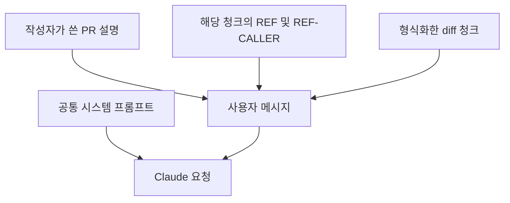

# Claude 입력 구성과 스트리밍

Claude 요청 하나에는 공통 시스템 프롬프트와 청크 하나의 사용자 메시지가 들어갑니다. 서비스가 Bitbucket JSON을 읽을 수 있는 diff 문자열로 바꾸고 PR 설명과 관련 CRG 증거를 결합합니다.

## 1. diff JSON을 문자열로 바꾸기

[`buildReviewDiffChunks()`](../../src/services/codeReview/diffFormatter.ts)는 파일별 hunk와 segment를 순회하며 라인 유형에 맞는 번호를 붙입니다.

| 표시 | 번호의 기준 | 용도 |
|---|---|---|
| `[ADD:N]` | 변경 후 `destination` | 추가 코드, 인라인 댓글 가능 |
| `[REM:N]` | 변경 전 `source` | 삭제 코드, 인라인 댓글 가능 |
| `[CTX:N]` | `destination` | 변경 없는 문맥, 판단에만 사용 |

각 파일 앞에 `FILE: 경로`를 넣어 응답의 `comments[].file`과 연결합니다. Bitbucket 요청의 `contextLines`와 formatter 기본값은 모두 25입니다. 긴 CONTEXT 구간은 앞뒤 25줄을 남기고 중간에 `[OMITTED]`를 넣습니다.

소스 파일을 먼저 처리하고 lockfile, 생성 파일, 빌드 산출물 등은 후순위로 둡니다. 후순위라고 리뷰에서 제외하지는 않습니다.

## 2. 청크 분할

기본 diff 문자 예산은 약 100,000자입니다. 파일을 채우다가 예산을 넘으면 라인 경계에서 다음 청크로 이어갑니다. 큰 파일은 다음 청크의 헤더에 `(이어서)`를 붙입니다.

```text
청크 1: src/users.ts + src/settings.ts 앞부분
청크 2: src/settings.ts 나머지 + src/session.ts
청크 3: package-lock.json
```

이 배치는 가상 예시입니다. 파일 하나가 곧 Claude 요청 하나인 것은 아닙니다. 작은 PR은 청크 하나에 담을 수 있습니다.

한 라인 자체가 예산보다 길면 `capLine()`이 앞부분만 남기고 `… [원본 라인이 너무 길어 잘림]`을 붙입니다. 진행을 위해 파일 헤더와 첫 라인을 함께 넣으므로 100,000자는 엄격한 요청 전체 상한이 아닙니다. PR 설명과 서버 증거도 청크 본문 바깥에 추가됩니다.

## 3. 설명 정리와 마스킹

[`reviewCode()`](../../src/services/codeReview/codeReview.ts)는 청크마다 다음 처리를 합니다.

1. `extractUserWrittenPrDescription()`으로 기본 템플릿의 미작성 안내 섹션을 제거합니다. 사용자가 작성한 내용과 자유 형식 설명은 유지합니다.
2. diff, 정리한 PR 설명, CRG 증거에 `maskSensitiveData()`를 적용합니다.
3. 내용이 남아 있는 설명과 증거만 사용자 메시지에 붙입니다.

마스킹은 이메일, 010 전화번호, 주민번호 형식, Basic/Bearer 인증 문자열, 일부 API 키와 Atlassian 토큰 형식을 치환합니다. 호출부 원본 코드에도 같은 규칙을 적용합니다. 정규식으로 모든 비밀정보를 제거한다고 보장하지는 않습니다.

## 4. 두 종류의 프롬프트 결합

시스템 프롬프트에는 리뷰 순서, 변경 공통 점검, 언어별 기준, 증거 사용 규칙, P1~P5와 출력 JSON을 넣습니다. [`CODE_REVIEW_SYSTEM_PROMPT`](../../src/prompts/codeReview.ts)는 정적 문자열이고 `cache_control: { type: 'ephemeral' }`로 캐싱을 요청합니다. 실제 재사용 여부는 SDK 응답의 사용량 로그에서 확인합니다.

사용자 메시지는 다음 순서입니다.



[`prReview.ts`](../../src/services/codeReview/prReview.ts)는 정의 파일이 해당 청크에 포함된 심볼의 증거만 선택합니다. 같은 파일이 여러 청크에 나뉘면 같은 심볼의 증거가 반복 포함될 수 있습니다. 함수 라인별로 청크와 증거를 대응하는 방식은 아닙니다.

아래는 사용자 메시지의 예시입니다. 변경 요약 문구는 설명용이며 자동 판정 문구와 다를 수 있습니다. 바깥 코드 블록은 안쪽 diff 블록이 깨지지 않도록 네 개의 백틱을 사용합니다.

````text
PR 설명:
사용자 조회에 tenantId를 추가했습니다.

[REF] getUser(src/users.ts) [판정: parameter-breaking] 필수 인자 tenantId가 추가됨 — 참조하지만 이번 PR에서 변경되지 않은 파일: src/profile.ts
[REF-CALLER] src/profile.ts:5-7 loadProfile (master 기준, getUser 사용부)
5| export function loadProfile(id: string) {
6|     return getUser(id);
7| }
[/REF-CALLER]

다음 PR diff를 리뷰해 주세요:

```diff
FILE: src/users.ts
---
[REM:10] -export function getUser(id: string) {
[ADD:10] +export function getUser(id: string, tenantId: string) {
[CTX:11]      return { id };
[CTX:12]  }
```
````

이때 Claude는 필수 인자를 추가한 변경과 기존 호출의 인자 하나를 함께 읽습니다. CRG 증거가 없는 경우에는 그 부분 없이 설명과 diff만 전송합니다.

## 5. 요청과 응답 스트리밍

현재 호출 설정은 다음과 같습니다. 기본 모델은 환경변수로 덮어쓸 수 있으며, 계정이나 프록시가 지원하는 ID인지 확인해야 합니다.

| 설정 | 값 |
|---|---|
| `model` | `CLAUDE_MODEL`, 기본 `claude-sonnet-5-5` |
| `max_tokens` | 16,384, adaptive thinking 포함 |
| `thinking` | `{ type: 'adaptive' }` |
| `output_config.effort` | `medium` |
| 전역 스트림 동시성 | `CLAUDE_STREAM_CONCURRENCY`, 기본 4 |

핵심 호출부를 발췌하면 다음과 같습니다.

```ts
const currentStream = requestClient.messages.stream({
    model: MODEL,
    max_tokens: MAX_OUTPUT_TOKENS,
    thinking: { type: 'adaptive' },
    output_config: { effort: REVIEW_EFFORT },
    system: [/* 공통 규칙 */],
    messages: [/* 해당 청크의 사용자 메시지 */],
});
const finalMessage = await currentStream.finalMessage();
```

완성된 입력을 요청으로 보내고 응답 조각을 스트리밍으로 받습니다. 서비스는 이벤트 타입과 개수 등을 진단 로그에 남기고 `finalMessage()`로 최종 응답을 기다립니다. 응답 조각마다 JSON을 파싱하거나 댓글을 게시하지 않습니다.

한 PR에서는 청크 1 응답과 파싱이 끝난 뒤 청크 2를 호출합니다. 각 요청은 독립적이며 이전 청크의 대화나 결과를 다음 요청에 넣지 않습니다. 여러 PR은 [`concurrencyLimiter.ts`](../../src/lib/concurrencyLimiter.ts)의 프로세스 내부 FIFO 대기열과 슬롯을 공유합니다.

[문서 목차](README.md) · [다음: 리뷰 출력과 댓글](review-output-and-comments.md)
