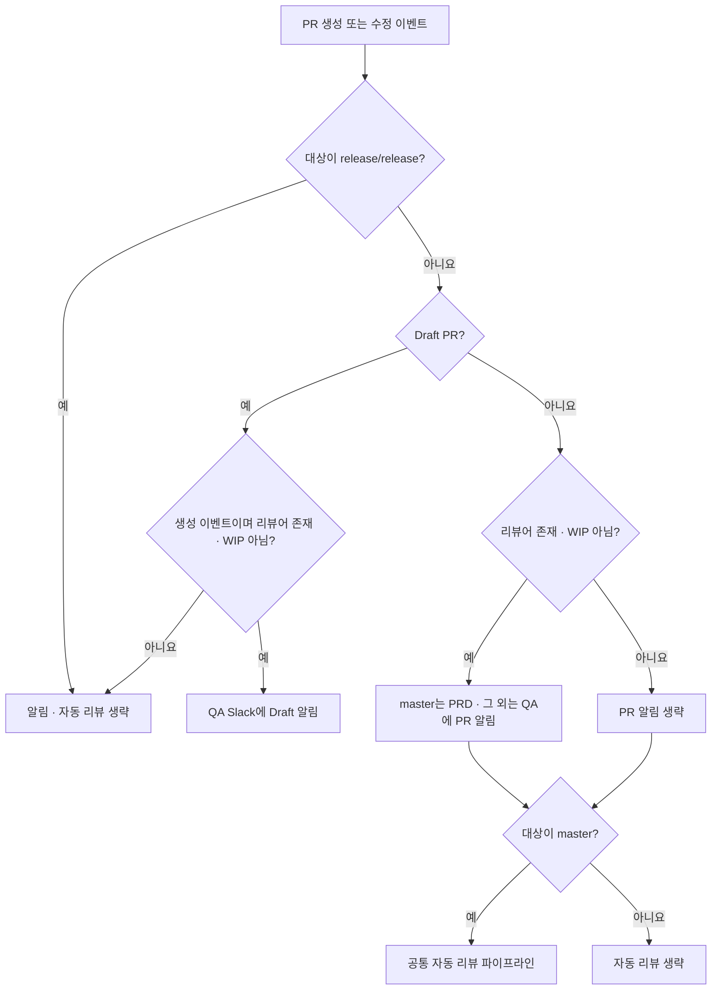
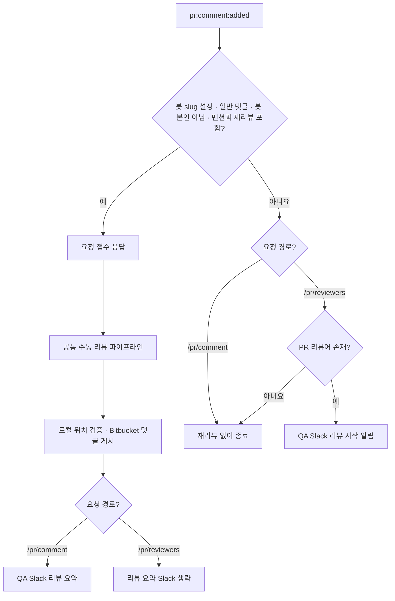
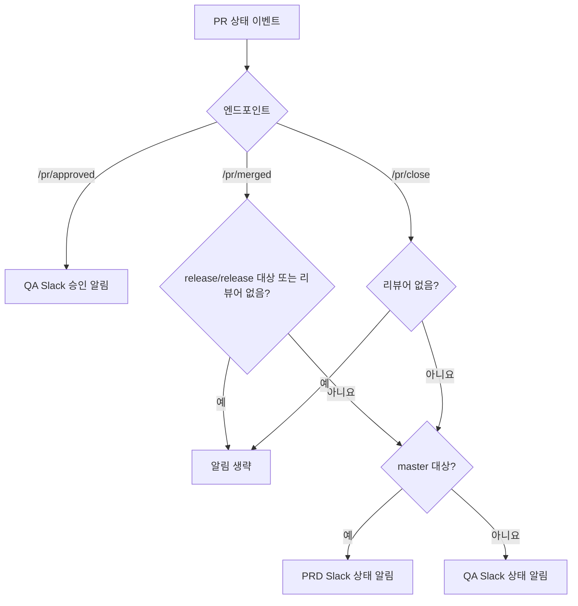
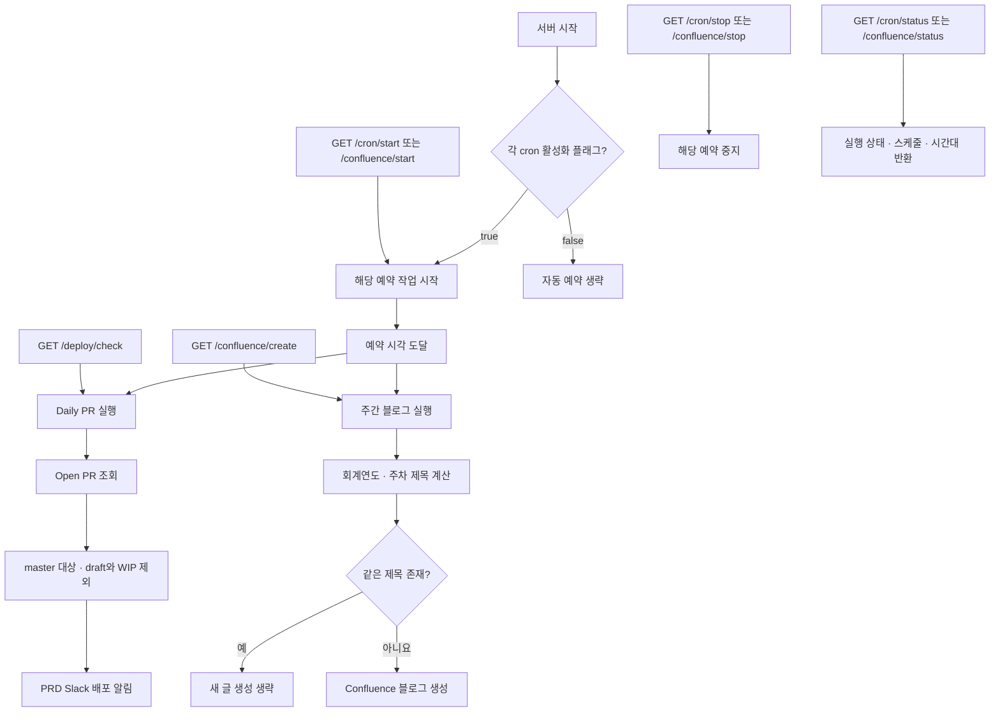

# 엔드포인트별 흐름

웹훅은 이벤트별 라우터로 들어오고, AI 분석이 필요한 요청만 공통 리뷰 파이프라인으로 이어집니다. 아래 그래프는 정상 이벤트의 주요 분기를 보여줍니다.

## 1. PR 생성과 수정

`POST /pr/open`, `POST /pr/modified`

PR 알림과 AI 리뷰는 조건이 다릅니다. 리뷰어가 없거나 WIP 제목이어도 `master` 대상 non-draft면 자동 리뷰를 시도합니다. 리뷰 완료를 기다리지 않고 웹훅 응답을 반환합니다.

## 2. 댓글 재리뷰

`POST /pr/comment`, `POST /pr/reviewers`

`/pr/reviewers`는 이름과 달리 리뷰어 변경 이벤트가 아닌 **댓글 이벤트**를 처리합니다. 재리뷰 조건이 아닌 댓글도 PR에 리뷰어가 있으면 리뷰 시작 알림으로 전달합니다. 두 경로에 같은 이벤트를 연결하면 처리가 겹칠 수 있으므로 재리뷰용 경로는 하나를 선택하세요.

## 3. 승인, 머지와 삭제 알림

`POST /pr/approved`, `POST /pr/merged`, `POST /pr/close`

세 경로는 상태 알림만 보내며 Claude 리뷰를 실행하지 않습니다. `/pr/close`는 `pr:deleted` 이벤트를 처리하고, `/pr/merged`와 달리 `release/release`를 별도로 제외하지 않습니다.

## 4. 예약 작업과 수동 관리

`GET /deploy/check`, `/cron/*`, `/confluence/*`

`start`·`stop`은 해당 예약을 제어합니다. `/deploy/check`와 `/confluence/create`는 예약 활성화 여부와 무관하게 즉시 실행합니다. `/health-check`는 서버 응답만 확인하며, PR 라우터의 `/health`는 `open`, `modified`, `comment`, `approved`, `merged`, `close`에 제공됩니다. 헬스체크는 외부 서비스 연결 상태까지 검증하지 않습니다.

## 관련 구현과 문서

- [라우터 등록과 관리 API](../../src/app.ts), [서버 시작](../../src/server.ts)
- [PR 생성](../../src/routes/pr/open.ts), [PR 수정](../../src/routes/pr/modified.ts)
- [댓글 재리뷰](../../src/routes/pr/comment.ts), [리뷰 시작 알림과 재리뷰](../../src/routes/pr/reviewers.ts)
- [승인](../../src/routes/pr/approved.ts), [머지](../../src/routes/pr/merged.ts), [삭제](../../src/routes/pr/close.ts)
- [Daily PR](../../src/cron/dailyPr.ts), [주간 블로그](../../src/cron/weeklyBlog.ts)

이 문서는 이벤트별 진입점과 알림 분기를 설명합니다. AI 리뷰 내부 과정은 [PR부터 댓글까지](pr-to-comments.md), 운영 조건은 [운영 가이드](../ai-code-review-agent-guide.md)를 참고하세요.

[문서 목차](README.md)
