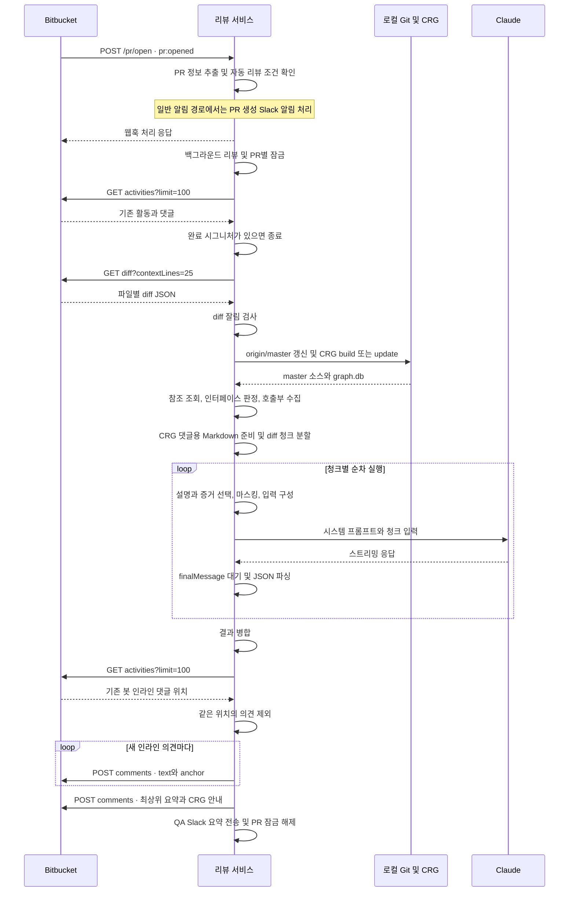

# PR 생성부터 리뷰 댓글까지

Bitbucket의 `pr:opened` 웹훅을 받은 뒤 자동 리뷰 조건을 확인하고, 공통 파이프라인에서 입력 준비와 결과 게시를 처리합니다. 아래 흐름은 CRG가 준비된 일반 모드의 정상 자동 리뷰를 기준으로 합니다.

## 전체 흐름

웹훅 응답은 리뷰 완료를 의미하지 않습니다. 일반 알림 경로에서는 응답 후 리뷰를 시작합니다. 리뷰어가 없거나 제목에 WIP가 있는 경로에서는 리뷰를 시작한 뒤 응답하므로, 응답과 백그라운드 실행의 순서는 경로에 따라 다릅니다.

## 1. 이벤트와 실행 조건

[`src/app.ts`](../../src/app.ts)는 `/pr/open` 라우터를 등록합니다. [`open.ts`](../../src/routes/pr/open.ts)는 `pullRequest`가 있는지와 `eventKey`가 `pr:opened`인지 확인합니다. `release/release` 대상은 먼저 종료합니다.

`extractPrContext()`는 별도 PR 상세 API 없이 웹훅에서 다음 값을 꺼냅니다.

| 정보 | 용도 |
|---|---|
| PR ID | diff 조회와 댓글 게시 |
| 제목과 설명 | 알림, 리뷰 의도 참고. 사용자 메시지에 들어가는 것은 정리한 설명 |
| 출발 및 대상 브랜치, draft | 자동 리뷰 조건 |
| actor와 리뷰어 목록 | 알림 표시와 라우터 분기 |
| 저장소 이름과 PR URL | 로그와 알림 |

자동 리뷰 조건은 대상 브랜치가 `master`이고 `draft !== true`인 경우입니다. 리뷰어가 없거나 제목에 WIP가 있어도 이 조건을 만족하면 리뷰를 시작합니다. Draft PR은 조건에 따라 Slack 알림만 보냅니다.

## 2. 중복 실행과 기존 완료 확인

[`runCodeReview()`](../../src/services/codeReview/prReview.ts)는 `reviewInProgress` Set으로 동일 PR의 동시 실행을 막습니다. 이 잠금은 프로세스 내부 범위입니다.

자동 리뷰는 Bitbucket 활동에서 댓글 텍스트에 `🤖 AI Code Review`가 있는지 확인하고, 있으면 종료합니다. 현재 완료 확인은 시그니처 문자열 검색이며 댓글 작성자를 별도로 대조하지 않습니다. 활동 조회는 `limit=100`으로 한 번 호출하며 추가 페이지를 순회하지 않습니다.

## 3. Bitbucket에서 받는 데이터

`PR_BASE`는 설정된 `BITBUCKET_API_URL`에서 쿼리 문자열을 제거한 PR 목록 주소입니다. [`bitbucket/index.ts`](../../src/services/bitbucket/index.ts)가 아래 요청을 처리합니다. 조회는 `BITBUCKET_AUTH_HEADER`, 댓글 작성은 `BITBUCKET_BOT_AUTH_HEADER`를 사용합니다.

| 시점 | 요청 | 받거나 보내는 내용 |
|---|---|---|
| 실행 전 | `GET PR_BASE/{id}/activities?limit=100` | 완료 시그니처 확인에 쓰는 활동과 댓글 |
| 입력 준비 | `GET PR_BASE/{id}/diff?contextLines=25` | 파일 경로, hunk, ADDED/REMOVED/CONTEXT 라인 |
| 게시 전 | `GET PR_BASE/{id}/activities?limit=100` | 봇 작성자와 anchor를 확인할 기존 댓글 |
| 인라인 게시 | `POST PR_BASE/{id}/comments` | `text`와 `anchor` |
| 최상위 게시 | `POST PR_BASE/{id}/comments` | `text`만 포함한 Markdown |

diff는 `diffs → hunks → segments → lines` 구조의 JSON입니다. 각 라인은 변경 전 번호 `source`, 변경 후 번호 `destination`, 코드 문자열 `line`을 담습니다. 서비스는 이 값을 이용해 코드와 댓글 위치를 연결합니다.

Bitbucket이 이미 일부 diff를 잘랐다면 불완전한 코드로 리뷰하지 않고 안내 댓글을 남깁니다. `truncated`는 최상위부터 파일, hunk, segment, 라인까지 검사합니다.

## 4. 입력 준비와 Claude 호출

CRG가 준비되면 변경 함수의 참조와 호출부를 수집하고 최종 댓글용 안내도 미리 만듭니다. 실패하면 일반 모드에서는 CRG 증거 없이 리뷰를 계속 시도합니다. [CRG 동작](crg-context.md)에 상세 과정이 있습니다.

diff는 문자열로 형식화한 뒤 약 100,000자 청크로 나눕니다. 한 청크에 여러 파일이 들어갈 수 있고 큰 파일은 여러 청크에 걸칠 수 있습니다. 각 청크에 PR 설명과 관련 서버 증거를 붙여 Claude에 순차 전송합니다. [입력과 스트리밍](claude-input-and-streaming.md)을 참고하세요.

## 5. 결과 정리와 게시

모든 청크의 응답 처리가 끝나면 서비스가 요약과 의견을 병합합니다. 기존 봇 댓글과 같은 위치의 의견을 제외한 뒤 새 인라인 댓글을 하나씩 게시하고, 최상위 요약에 CRG 참조 안내를 붙입니다. 스트리밍 중에는 댓글을 게시하지 않습니다.

자동 리뷰는 로컬 인라인 위치 검증이 꺼져 있습니다. 수동 재리뷰는 같은 파이프라인에 그 검증을 켜고 기존 완료 시그니처 확인을 생략합니다. [출력과 댓글](review-output-and-comments.md)에 차이와 API 본문 예제가 있습니다.

최종 댓글 게시 후 자동 리뷰 요약을 QA Slack으로 보냅니다. `finally`에서 PR 잠금을 해제하므로 실패하거나 중간 종료해도 잠금을 정리합니다. 실패는 단계별로 처리 방식이 다릅니다. [제한과 실패 처리](limits-and-failure-handling.md)를 참고하세요.

[문서 목차](README.md) · [다음: CRG가 보완하는 맥락](crg-context.md)
